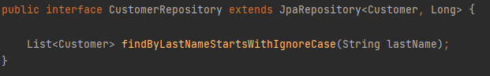

**КАТЕДРА “Математика и информатика ”** 

** 
#
#
# **КУРСОВА РАБОТА** 
** 

**Дисциплина:**

Уеб програмиране с Java
**

** 
**

** 

**Специалност ,,Софтуерно инженерство,,** 

**ОКС**   *бакалавър* 

**Форма на обучение***: редовно* 
**

**

**В.Търново, 2022г.** 

*Изглед:*

След стартиране на проекта и писане на localhost:8080 би трябвало да видим Login страницата по този начин:

`	`А след правилно изписване на потребителско име и парола се вижда списъка с клиенти:

*

Използваме H2 база данни:

Добавяме нов запис:

Изтриваме новия запис: 

Има и възможността да филтрира клиентите по фамилия:

*Кодова част:*

Създаваме модела за клиентите в Customer.java:

Дефинираме Customer repository в CustomerRepository.java:

Класa JavauniApplication го използваме за добавяне на** обекти:

Добавяме в pom.xml Vaadin Dependencies: 

В MainView класа си създаваме изгледа на сайта:

Функционалстта на бутоните е в CustomerEditor:

Правим и Login view:

И настройваме нещата в SecurityConfig:

